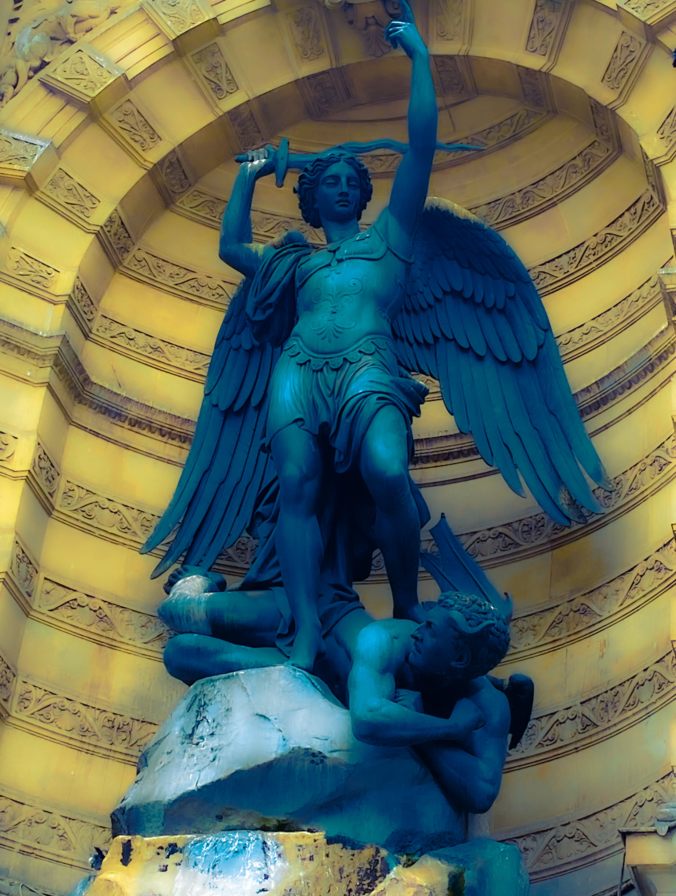

# The Goetia

<figure><figcaption></figcaption></figure>

## <mark style="color:blue;">Goetia is the arts of summoning and exercising control over demonic entities, based on their "Offices". Each of the demons has its sigil, and an angel who operates with them.</mark>

## <mark style="color:purple;">The goetia is a component of the grimoire known as "The Lesser Key of  Salomon" (Lemegeton).</mark>

> ☝🏽 **"Goetia," finds its roots in the ancient Greek term "goēs," signifying "magician.**&#x20;
