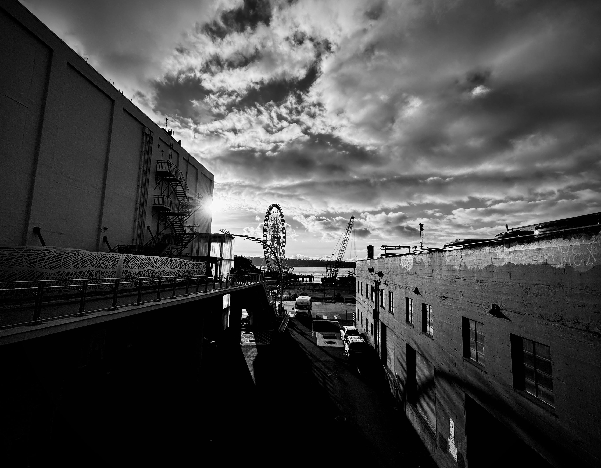

# 🖊 Letter from Jung to Freud, 1911

<figure><figcaption></figcaption></figure>

### <mark style="color:blue;">**"My evenings are taken up largely with astrology. I make horoscopic calculations in order to find a clue to the core of psychological truth.**</mark>&#x20;

### <mark style="color:blue;">**Some remarkable things have turned up which will certainly appear incredible to you… I dare say that we shall one day discover in astrology a good deal of knowledge that has been intuitively projected into the heavens."**</mark>

### <mark style="color:blue;">**- Dr. CG Jung**</mark>
