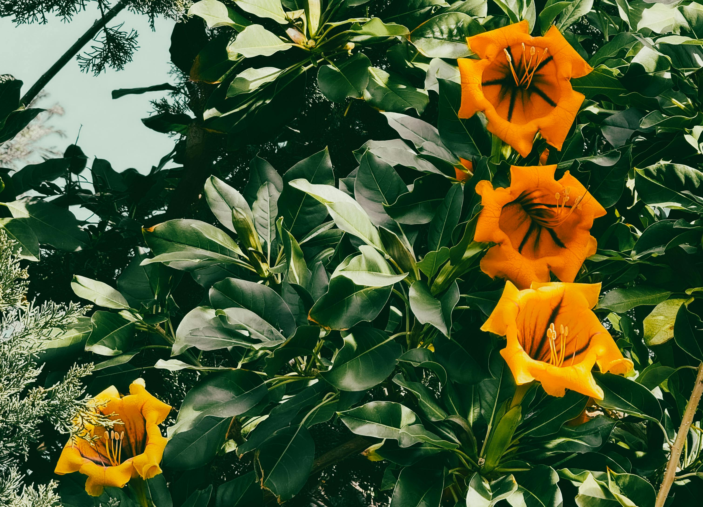

# Non Violent Resistance

<figure><figcaption></figcaption></figure>

### <mark style="color:purple;">Chaos is always better than tyranny (because at least individual freedom is preserved).</mark>

> [**Non Violent Resistance**](https://en.wikipedia.org/wiki/Nonviolent\_resistance)**.**
