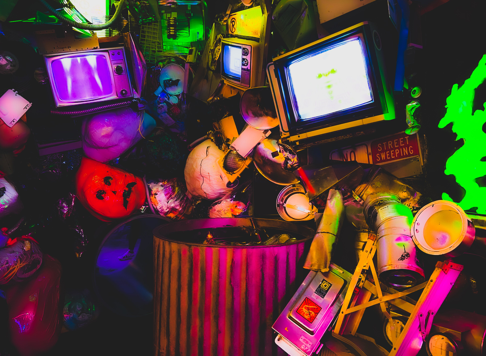

# 🦹♀ 𝙸𝚗𝚝𝚎𝚛𝚊𝚌𝚝𝚒𝚟𝚎 𝙲𝚒𝚗𝚎𝚖𝚊

<figure><figcaption></figcaption></figure>

### <mark style="color:green;">Interactive cinema</mark> <mark style="color:purple;">gives</mark>

### <mark style="color:purple;">an audience an active role.</mark>

### <mark style="color:purple;">A</mark> <mark style="color:green;">hybrid between participation and viewing</mark><mark style="color:purple;">,</mark>&#x20;

### <mark style="color:purple;">giving the player a strong amount of</mark> <mark style="color:green;">control</mark>&#x20;

### <mark style="color:purple;">in the</mark> <mark style="color:green;">characters' decisions</mark><mark style="color:purple;">.</mark>
