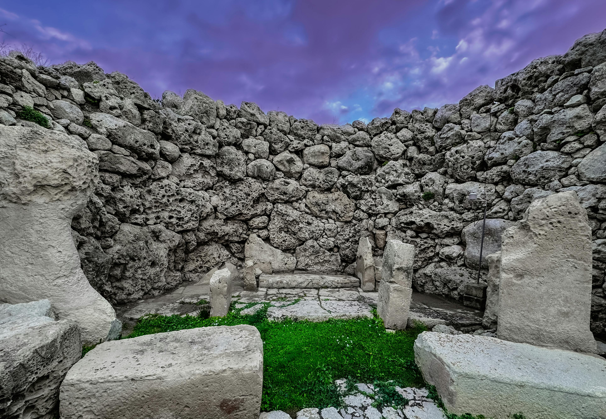

# Meanings for The High Priestess

<figure><figcaption></figcaption></figure>

### <mark style="color:purple;">purity</mark>

### <mark style="color:purple;">intuition</mark>

### <mark style="color:purple;">gracious influence enters the matter</mark>

### <mark style="color:purple;">spiritual changes</mark>

### <mark style="color:purple;">increase and decrease</mark>

### &#x20;<mark style="color:purple;">fluctuation</mark>

### <mark style="color:purple;">exuberance tempered</mark>

### <mark style="color:purple;">careful balance</mark>

